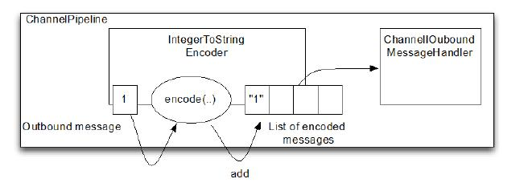

Encoder(编码器)
====

回顾之前的定义，encoder 是用来把出站数据从一种格式转换到另外一种格式，因此它实现了 ChannelOutboundHandler。正如你所期望的一样，类似于 decoder，Netty 也提供了一组类来帮助你写 encoder，当然这些类提供的是与 decoder 相反的方法，如下所示：

* 编码从消息到字节
* 编码从消息到消息

### MessageToByteEncoder

之前我们学习了如何使用 ByteToMessageDecoder 来将字节转换成消息，现在我们使用 MessageToByteEncoder 实现相反的效果。

Table 7.3 MessageToByteEncoder API

方法名称 | 描述
-------|------
encode | The encode method is the only abstract method you need to implement. It is called with the outbound message, which this class will encodes to a ByteBuf. The ByteBuf is then forwarded to the next ChannelOutboundHandler in the ChannelPipeline.

这个类只有一个方法，而 decoder 却是有两个，原因就是 decoder 经常需要在 Channel 关闭时产生一个“最后的消息”。出于这个原因，提供了decodeLast()，而 encoder 没有这个需求。

下面示例，我们想产生 Short 值，并想将他们编码成 ByteBuf 来发送到 线上，我们提供了 ShortToByteEncoder 来实现该目的。

Figure 7.3 ShortToByteEncoder

上图展示了，encoder 收到了 Short 消息，编码他们，并把他们写入 ByteBuf。 ByteBuf 接着前进到下一个 pipeline 的ChannelOutboundHandler。每个 Short 将占用 ByteBuf 的两个字节

Listing 7.5 ShortToByteEncoder encodes shorts into a ByteBuf

	public class ShortToByteEncoder extends
	        MessageToByteEncoder<Short> {  //1
	    @Override
	    public void encode(ChannelHandlerContext ctx, Short msg, ByteBuf out)
	            throws Exception {
	        out.writeShort(msg);  //2
	    }
	}

1. 实现继承自 MessageToByteEncoder
2. 写 Short 到 ByteBuf

Netty 提供很多 MessageToByteEncoder 类来帮助你的实现自己的 encoder 。其中 WebSocket08FrameEncoder 就是个不错的范例。可以在  io.netty.handler.codec.http.websocketx 包找到。

### MessageToMessageEncoder  

我们已经知道了如何将入站数据从一个消息格式解码成另一个格式。现在我们需要一种方法来将出站数据从一种消息编码成另一种消息。MessageToMessageEncoder 提供此功能,见表7.4，同样的只有一个方法,因为不需要产生“最后的消息”。

Table 7.4 MessageToMessageEncoder API

方法名称 | 描述
-------|------
encode | The encode method is the only abstract method you need to implement. It is called for each message written with write(...) to encode the message to one or multiple new outbound messages. The encoded messages are then forwarded

下面例子，我们将要解码 Integer 消息到 String 消息。可简单使用 MessageToMessageEncoder

Figure 7.4 IntegerToStringEncoder

encoder 从出站字节流提取 Integer，以 String 形式传递给ChannelPipeline 中的下一个 ChannelOutboundHandler 。清单7.6
显示了细节。

Listing 7.6 IntegerToStringEncoder encodes integer to string

	public class IntegerToStringEncoder extends
	        MessageToMessageEncoder<Integer> { //1
	
	    @Override
	    public void encode(ChannelHandlerContext ctx, Integer msg, List<Object> out)
	            throws Exception {
	        out.add(String.valueOf(msg));  //2
	    }
	}

1. 实现继承自 MessageToMessageEncoder
2. 转 Integer 为 String，并添加到 MessageBuf

更复杂 的 MessageToMessageEncoder 应用案例，可以查看 io.netty.handler.codec.protobuf 包下的 ProtobufEncoder