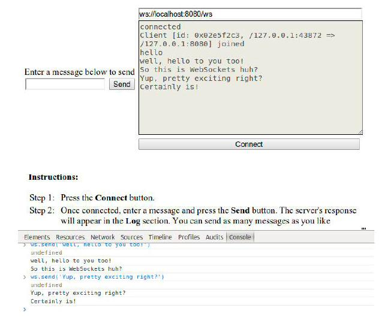

测试程序
====

使用下面命令启动服务器：

	mvn -PChatServer clean package exec:exec

其中项目中的 pom.xml 是配置了 9999 端口。你也可以通过下面的方法修改属性

	mvn -PChatServer -Dport=1111 clean package exec:exec

下面是控制台的主要输出(删除了部分行)

Listing 11.5 Compile and start the ChatServer
	
	[INFO] Scanning for projects...
	[INFO]
	[INFO] ------------------------------------------------------------------------
	[INFO] Building ChatServer 1.0-SNAPSHOT
	[INFO] ------------------------------------------------------------------------
	...
	[INFO]
	[INFO] --- maven-jar-plugin:2.4:jar (default-jar) @ netty-in-action ---
	[INFO] Building jar: D:/netty-in-action/chapter11/target/chat-server-1.0-SNAPSHOT.jar
	[INFO]
	[INFO] --- exec-maven-plugin:1.2.1:exec (default-cli) @ chat-server ---
	Starting ChatServer on port 9999

可以在浏览器中通过 http://localhost:9999 地址访问程序。图11.5展示了此程序在Chrome浏览器下的用户界面。

Figure 11.5 WebSockets ChatServer demonstration

图中显示了两个已经连接了的客户端。第一个客户端是通过上面的图形界面连接的，第二个是通过Chrome浏览器底部的命令行连接的。
你可以注意到，这两个客户端都在发送消息，每条消息都会显示在两个客户端上。
###如何加密？

在实际场景中，加密是必不可少的。在Netty中实现加密并不麻烦，你只需要向 ChannelPipeline 中添加 SslHandler ，然后配置一下即可。如下：

Listing 11.6 Add encryption to the ChannelPipeline

	public class SecureChatServerIntializer extends ChatServerInitializer {	//1
	    private final SslContext context;
	
	    public SecureChatServerIntializer(ChannelGroup group, SslContext context) {
	        super(group);
	        this.context = context;
	    }
	
	    @Override
	    protected void initChannel(Channel ch) throws Exception {
	        super.initChannel(ch);
	        SSLEngine engine = context.newEngine(ch.alloc());
	        engine.setUseClientMode(false);
	        ch.pipeline().addFirst(new SslHandler(engine)); //2
	    }
	}
	
1.扩展 ChatServerInitializer 来实现加密

2.向 ChannelPipeline 中添加SslHandler

最后修改 ChatServer，使用 SecureChatServerInitializer 并传入 SSLContext

Listing 11.7 Add encryption to the ChatServer

	public class SecureChatServer extends ChatServer {//1
	
	    private final SslContext context;
	
	    public SecureChatServer(SslContext context) {
	        this.context = context;
	    }
	
	    @Override
	    protected ChannelInitializer<Channel> createInitializer(ChannelGroup group) {
	        return new SecureChatServerIntializer(group, context);	//2
	    }
	
	    public static void main(String[] args) throws Exception{
	        if (args.length != 1) {
	            System.err.println("Please give port as argument");
	            System.exit(1);
	        }
	        int port = Integer.parseInt(args[0]);
	        SelfSignedCertificate cert = new SelfSignedCertificate();
	        SslContext context = SslContext.newServerContext(cert.certificate(), cert.privateKey());
	        final SecureChatServer endpoint = new SecureChatServer(context);
	        ChannelFuture future = endpoint.start(new InetSocketAddress(port));
	
	        Runtime.getRuntime().addShutdownHook(new Thread() {
	            @Override
	            public void run() {
	                endpoint.destroy();
	            }
	        });
	        future.channel().closeFuture().syncUninterruptibly();
	    }
	}

1.扩展 ChatServer

2.返回先前创建的 SecureChatServerInitializer 来启用加密

这样，就在所有的通信中使用了 [SSL/TLS](http://tools.ietf.org/html/rfc5246) 加密。和前面一样，你可以使用Maven拉取应用需要的所有依赖，并启动它，如下所示。

Listing 11.8 Start the SecureChatServer
	
	$ mvn -PSecureChatServer clean package exec:exec
	[INFO] Scanning for projects...
	[INFO]
	[INFO] ------------------------------------------------------------------------
	[INFO] Building ChatServer 1.0-SNAPSHOT
	[INFO] ------------------------------------------------------------------------
	...
	[INFO]
	[INFO] --- maven-jar-plugin:2.4:jar (default-jar) @ netty-in-action ---
	[INFO] Building jar: D:/netty-in-action/chapter11/target/chat-server-1.0-SNAPSHOT.jar
	[INFO]
	[INFO] --- exec-maven-plugin:1.2.1:exec (default-cli) @ chat-server ---
	Starting SecureChatServer on port 9999
	
现在你可以通过 HTTPS 地址: https://localhost:9999   来访问SecureChatServer 了。

